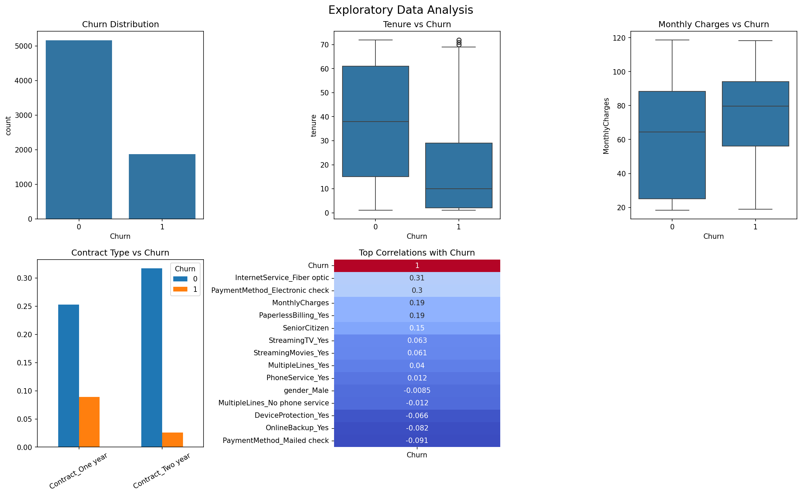
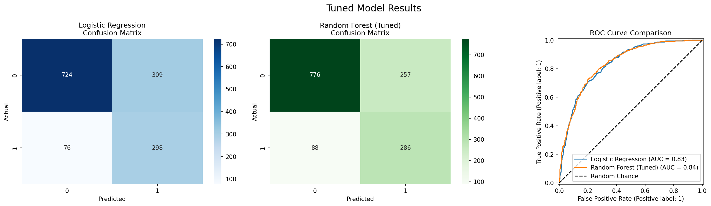
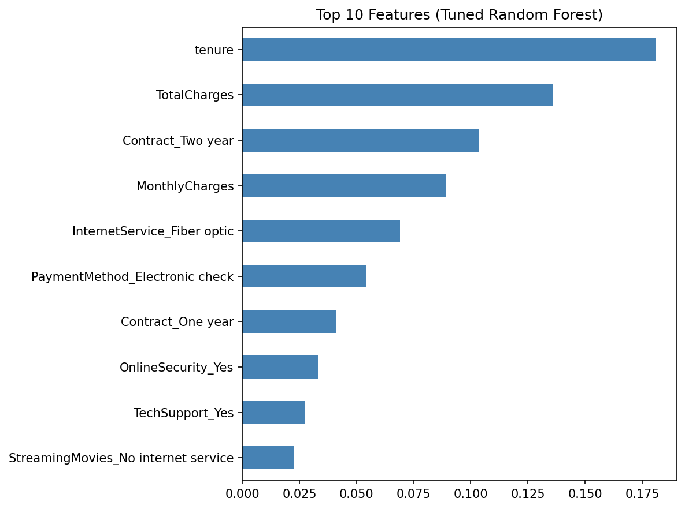

# Customer_Churn
# Customer Churn Prediction

A machine learning project that predicts whether a telecom customer will churn (cancel their subscription), built with Python and deployed as an interactive web app using Streamlit.

---

## Live Demo

> Run locally with:
```bash
streamlit run app.py
```
Then open your browser at `http://localhost:8501`

---

## Project Overview

Customer churn is one of the most costly problems for subscription-based businesses. This project builds an end-to-end ML pipeline that:

- Analyzes customer behavior using the **Telco Customer Churn** dataset (7,043 customers, 21 features)
- Trains and compares **Logistic Regression** and **Random Forest** models
- Uses **RandomizedSearchCV** with 5-fold cross-validation to tune the best model
- Deploys a **Streamlit web app** where you can input customer details and get an instant churn prediction with risk level and key risk factors

---

## Results

| Model | Accuracy | ROC-AUC | CV ROC-AUC (5-fold) |
|---|---|---|---|
| Logistic Regression | ~80% | ~0.85 | ~0.84 ± 0.01 |
| Random Forest (Default) | ~79% | ~0.83 | ~0.82 ± 0.01 |
| **Random Forest (Tuned)** | **~81%** | **~0.86** | **~0.85 ± 0.01** |

>  The tuned Random Forest achieved the best ROC-AUC, with consistent performance across all 5 cross-validation folds.

---

##  Key Findings

From feature importance and EDA analysis:

- **Contract type** is the strongest predictor — month-to-month customers churn far more than those on 1 or 2 year contracts
- **Tenure** matters a lot — customers in their first 12 months are at the highest risk
- **Monthly charges** above ~$70 correlate strongly with churn
- **Electronic check** payment method has the highest churn rate among all payment types
- **Fiber optic** internet users without online security churn significantly more

---

##  Project Structure

```
churn-prediction/
│
├── churn_prediction.py     # Full ML pipeline (EDA, training, tuning, saving)
├── app.py                  # Streamlit web app
│
├── churn_model.pkl         # Saved tuned Random Forest model
├── scaler.pkl              # Saved StandardScaler
├── feature_columns.pkl     # Saved feature column names
│
├── eda_plots.png           # EDA visualizations
├── model_comparison.png    # Confusion matrices + ROC curves
├── feature_importance.png  # Top 10 features chart
│
├── requirements.txt        # Python dependencies
└── README.md               # This file
```

---

##  Tech Stack

| Tool | Purpose |
|---|---|
| Python 3.x | Core language |
| Pandas | Data loading and manipulation |
| NumPy | Numerical operations |
| Matplotlib / Seaborn | Data visualization |
| Scikit-learn | ML models, scaling, tuning, evaluation |
| Streamlit | Web app deployment |
| Pickle | Model serialization |

---

##  How to Run

### 1. Clone the repository
```bash
git clone https://github.com/Samarthisawesome/churn-prediction.git
cd churn-prediction
```

### 2. Install dependencies
```bash
pip install -r requirements.txt
```

### 3. Add the dataset
Download the dataset from [Kaggle](https://www.kaggle.com/datasets/blastchar/telco-customer-churn) and place `WA_Fn-UseC_-Telco-Customer-Churn.csv` in the project folder.

### 4. Train the model
```bash
python churn_prediction.py
```
This generates `churn_model.pkl`, `scaler.pkl`, and `feature_columns.pkl`.

### 5. Launch the app
```bash
streamlit run app.py
```

---

##  ML Pipeline

```
Raw CSV
   │
   ▼
Data Cleaning          → fix TotalCharges dtype, drop nulls, drop customerID
   │
   ▼
Encoding               → map Churn to 0/1, one-hot encode categoricals
   │
   ▼
EDA                    → countplots, boxplots, correlation heatmap
   │
   ▼
Train/Test Split       → 80/20 split, stratified by Churn
   │
   ▼
Feature Scaling        → StandardScaler (fit on train, transform both)
   │
   ▼
Model Training         → Logistic Regression + Random Forest (baseline)
   │
   ▼
Hyperparameter Tuning  → RandomizedSearchCV, 50 iterations, 5-fold CV
   │
   ▼
Evaluation             → Accuracy, ROC-AUC, Classification Report, Confusion Matrix
   │
   ▼
Save Artifacts         → churn_model.pkl, scaler.pkl, feature_columns.pkl
   │
   ▼
Streamlit App          → Live predictions with risk level + key risk factors
```

---

##  Screenshots


### EDA


### Model Comparison


### Feature Importance


---

##  Requirements

Create a `requirements.txt` file with:

```
pandas
numpy
matplotlib
seaborn
scikit-learn
streamlit
```

Install with:
```bash
pip install -r requirements.txt
```

---

##  Dataset

- **Source:** [Telco Customer Churn — Kaggle](https://www.kaggle.com/datasets/blastchar/telco-customer-churn)
- **Rows:** 7,043 customers
- **Features:** 21 (demographics, account info, services subscribed)
- **Target:** `Churn` — Yes/No

---

##  Author

**Your Name**
- GitHub: [@Samarthisawesome](https://github.com/Samarthisawesome)


---

